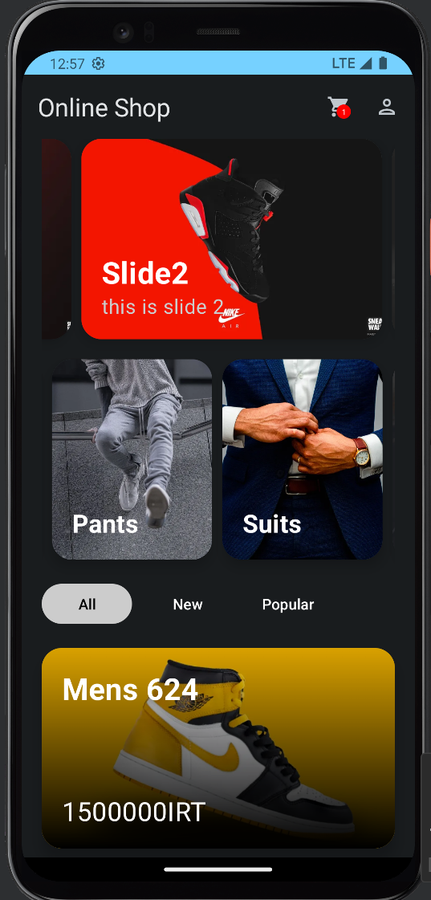
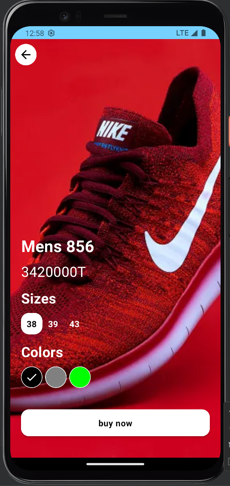
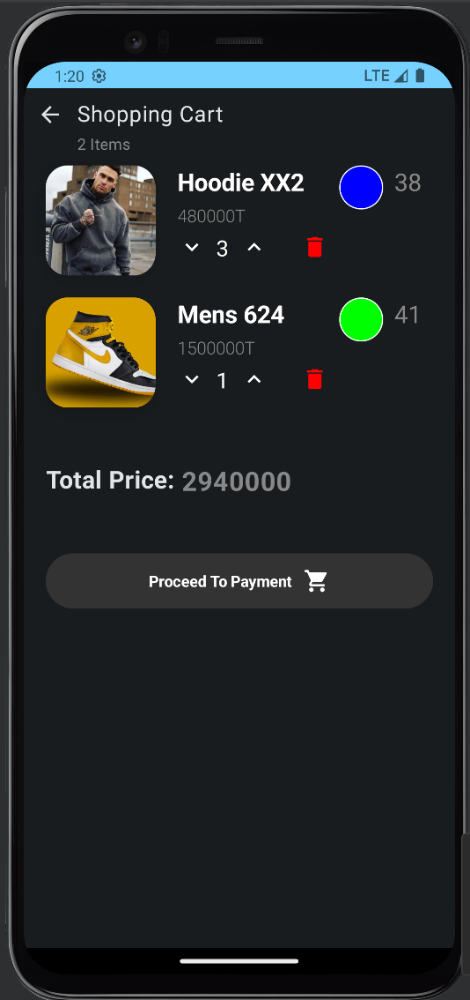
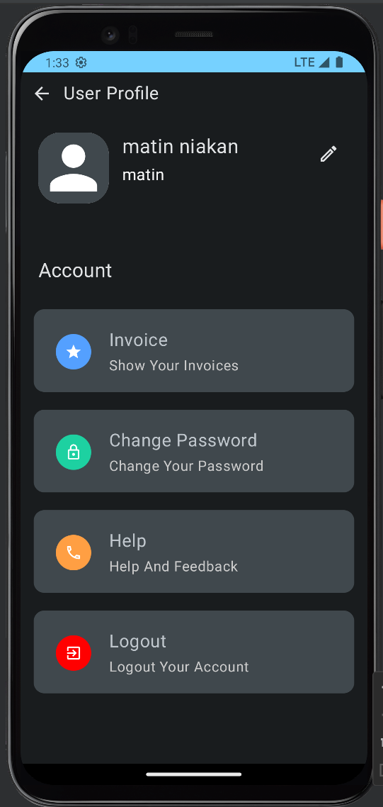

## TechStack

- [Kotlin](https://kotlinlang.org/)  
- [MVVM (Model-View-ViewModel)](https://developer.android.com/topic/architecture)  
- [Jetpack Compose](https://developer.android.com/jetpack/compose)  
- [Hilt & Dagger](https://dagger.dev/hilt/)  
- [Room](https://developer.android.com/training/data-storage/room)  
- [Retrofit](https://square.github.io/retrofit/)  
- [Kotlin Coroutines](https://kotlinlang.org/docs/coroutines-overview.html)  
- [LiveData](https://developer.android.com/topic/libraries/architecture/livedata)  

## Screenshots

<table>
  <tr>
    <td></td>
    <td></td>
    <td></td>
    <td></td>
  </tr>
   <tr>
    <td></td>
    <td></td>
    <td></td>
  </tr>
</table>

